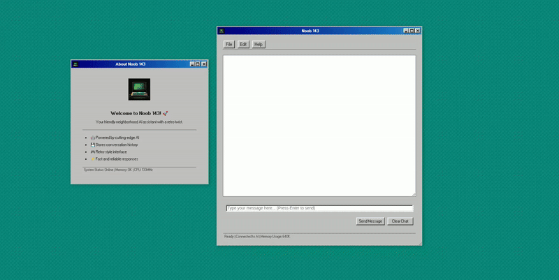
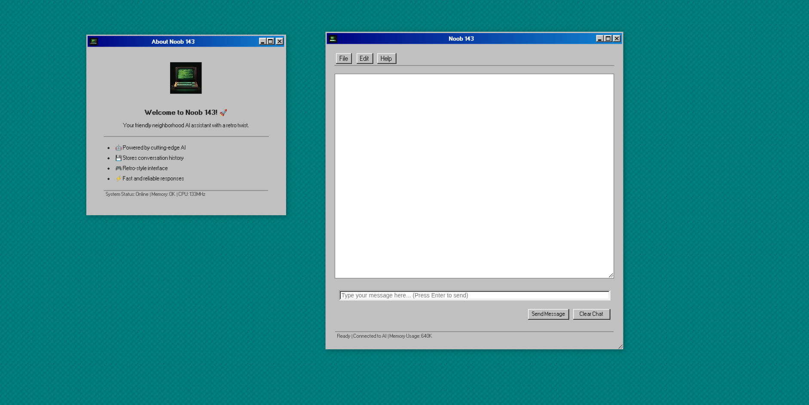

# GraphitiNoobPOC

A document processing and knowledge graph application that leverages LLMs and knowledge graphs for intelligent information retrieval.



## Overview

GraphitiNoobPOC is a proof-of-concept application that integrates:
- Knowledge graph-based data storage using Graphiti
- LLM-powered retrieval system
- FastAPI backend with streaming responses
- Model Context Protocol (MCP) integration
- Web-based UI for querying the system

The application processes documents, stores them in a knowledge graph, and allows intelligent semantic search with contextual awareness.

## Features

- Document ingestion and processing
- Knowledge graph storage and retrieval
- LLM-powered intelligent search
- Three search modes: focused, detailed, and timeline
- Conversation history tracking
- Streaming responses
- Intuitive web interface

## Requirements

- Python 3.11+
- Neo4j database
- OpenAI API key (or other compatible LLM)

## Installation

```bash
# Clone the repository
git clone https://github.com/SuyodhanJ6/graphitiNoobPOC.git
cd graphitiNoobPOC

# Create and activate a virtual environment using uv
uv venv --python 3.11
source .venv/bin/activate  # On Windows: .venv\Scripts\activate

# Install dependencies
uv sync
```

## Configuration

Create a `.env` file in the root directory with:

```
OPENAI_API_KEY=your_openai_api_key
NEO4J_URI=bolt://localhost:7687
NEO4J_USERNAME=neo4j
NEO4J_PASSWORD=your_password
```

## Running the Application

### 1. Start the MCP Server

For Model Context Protocol integration, start the markitdown MCP server:

```bash
markitdown-mcp --sse --host 127.0.0.1 --port 3001
```

### 2. Start the Main Application

```bash
uv run main.py
```

The server will start at http://localhost:8080 with API docs available at http://localhost:8080/docs.

## Architecture

The system uses the Graphiti flow for document processing:
1. Document ingestion
2. Text extraction
3. Embedding generation
4. Knowledge graph storage
5. Query processing through LLMs
6. Response generation

For more details on the Graphiti flow, see: [Graphiti MCP Server](https://github.com/getzep/graphiti/blob/main/mcp_server/README.md)

For markdown MCP integration details: [Markitdown MCP](https://github.com/microsoft/markitdown/tree/main/packages/markitdown-mcp)

## License

MIT

## Version Information



## Contact

Prashant Malge - prashantmalge181@gmail.com